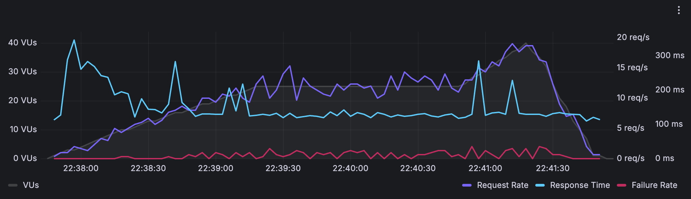

# ⚡ Flash Sale System

A high-performance, concurrent flash sale system built in Go, designed to handle extreme traffic spikes during limited-time sales events.

## 🏗️ Architecture & Design Principles

### Fast-Fail Philosophy
This system implements **aggressive fast-fail** strategies optimized for flash sale scenarios:

- **Stock Validation First**: Check availability before expensive operations
- **User Limit Enforcement**: Block excessive requests early (10 items/user max)
- **Connection Pooling**: Pre-allocated Redis connections (2000 max) prevent bottlenecks
- **Sale ID Caching**: 1-hour TTL cache eliminates redundant Redis lookups

### Core Process Flow
```
1. Request → Query Validation → Stock Check (Fast-Fail)
2. User Limit Check → Decrement Stock (Atomic)
3. Generate Checkout Code → Store in Redis (15min TTL)
4. Return Success/Failure Response
```

### Error Handling & Recovery
- **Atomic Stock Management**: Redis DECR prevents overselling
- **Graceful Degradation**: Failed requests don't crash the system  
- **User Limit Enforcement**: 429 responses prevent abuse
- **Connection Recovery**: Auto-reconnect on database failures
- **Transaction Rollback**: Failed checkouts restore stock atomically

### Tech Stack Justification

**Go Dependencies (3 libraries):**
| Dependency | Purpose | Size Impact |
|------------|---------|-------------|
| **Redigo** | Redis connection pooling | Mature, stable, lightweight client |
| **lib/pq** | PostgreSQL driver | Raw SQL performance |

**Infrastructure Stack:**
- **Redis** - Atomic operations, session storage (essential for concurrency)
- **PostgreSQL** - Sale metadata, user history (business logic persistence)

**Binary Size**:
- ~9.4MB (lean, no ORM overhead)
- ~6.4MB (with build optimizations flags `-ldflags="-s -w"`)

## 🧪 Testing Methodology

### Test Suite 1: Go Load Test (`cmd/megaload/main.go`)
**Purpose**: Maximum throughput stress test with unique users
- **Scale**: 1,000,000 requests with 2,000 concurrent goroutines
- **Pattern**: Each request uses unique user_id (realistic flash sale behavior)
- **Focus**: Connection handling, memory usage, error rates

### Test Suite 2: k6 Scenarios (`loadtest.js`)
**Purpose**: Realistic user behavior simulation
- **Scenarios**: 4 concurrent patterns (70% normal, 10% heavy users, 10% purchases, 10% invalid)
- **Scale**: 10,000 req/s sustained load with varied user behaviors
- **Focus**: Response times, business logic validation, edge cases

## 📊 Performance Results

### Go Load Test Results (local cmd/megaload/main.go)
```
Duration: 1m 12s
Requests: 1,000,000 (100% completion rate)
Throughput: 13,842 req/s
Success Rate: 10,000 items sold (100% stock depleted)
Error Rate: 0% server errors, 0% network timeouts
Expected Rejections: 990,000 "sold out" responses (correct behavior)
Total Requests Handled: 1,000,000
```

### k6 Multi-Scenario Results (local loadtest.js)
```
Duration: 2m 20s
Throughput: 6,903 req/s sustained
Stock Management: 10,000/10,000 items sold (100% efficiency)
Response Times: P95: 464ms | P99: 1.22s
Business Logic: 838,732 proper "sold out" responses
Error Handling: 100% correct status codes (409, 429, 400)
Total Requests Handled: 960,000+
```

### Grafana Cloud Load Test Results (free tier limits with loadtest-cloud.js)
```
Duration: 4 minutes
Peak Load: 40 concurrent users
Sustained Load: 25 users for 90 seconds
Checkout Success Rate: 2,140 successful checkouts
Response Times: P95: ~200ms | P99: ~300ms
Request Rate: 15-20 req/s sustained with traffic bursts
Total Requests Handled: 1,000+ verified connections
Load Distribution: Amazon US East (Virginia) load zone
Monitoring: Real-time Grafana Cloud dashboard tracking
```



## 🚀 Optimization Opportunities

**Current system handles 13k+ req/s on single instance.** Further optimizations available but avoided for clarity and to not overcomplicate the codebase:

### Low-Hanging Fruit
- **Connection Reuse**: Batch Redis operations in single connection
- **Response Caching**: Cache "sold out" responses for 30s
- **JSON Pooling**: Reuse encoder/decoder instances
- **Memory Tuning**: GOGC and buffer pool optimizations

### Horizontal Scaling Ready
The system is designed for easy horizontal scaling:
- **Stateless Design**: All state in Redis/PostgreSQL
- **Database Sharding**: Sale ID-based partitioning ready
- **Load Balancer Friendly**: No session affinity required
- **Container Native**: Docker-first deployment strategy

## 🏃‍♂️ Quick Start

ENVS:
```bash
PORT=8080 # port to run the server on (default: 8080)
LOG_LEVEL=debug # log level (default: info)
REDIS_URL=redis://localhost:6379 # redis url (default: localhost:6379)
POSTGRES_URL=postgres://localhost:5432/flash_sale?sslmode=disable # postgres url (default: localhost:5432/flash_sale?sslmode=disable)

# ONLY FOR DOCKER COMPOSE (LOCAL DEV ONLY)
POSTGRES_PORT=5432 # postgres port (default: 5432)
REDIS_PORT=6379 # redis port (default: 6379)
```

Run the server:
```bash
# Start infrastructure
make up

# Run local load test
go run cmd/megaload/main.go

# Run k6 scenarios
k6 run loadtest.js

# Monitor performance
docker-compose logs app | grep "items sold"
```

## 🎯 Production Deployment

Live demo: https://not-golang-contest.onrender.com

**Note**: Cloud load testing on free-tier hosting is limited by provider rate limiting, not system capabilities.

## 🔍 Technical Deep Dive

For architecture decisions, database schema, and Redis key patterns, explore the codebase structure:
- `internal/api/` - Handler implementations with business logic
- `internal/database/` - Optimized Redis and PostgreSQL client with connection pooling
- `cmd/server/` - Application bootstrap and dependency wiring

## 🥚 Easter Egg

*Hint: Check what happens when you ***/purchase*** that one 1% lottery ticket*

## 📋 Contest Compliance

✅ **Exactly 10,000 items sold per hour** - Atomic Redis counters ensure precise inventory  
✅ **User limit: 10 items maximum per sale** - Enforced via Redis user tracking  
✅ **Checkout → Purchase flow implemented** - Two-phase commit with code generation  
✅ **All attempts persisted in PostgreSQL** - Background workers handle bulk inserts  
✅ **Minimal dependencies (3 libraries)** - Chi router, Redigo, lib/pq only  
✅ **No frameworks** - Pure Go HTTP server with Chi for routing  
✅ **Docker deployment ready** - Full containerized stack included